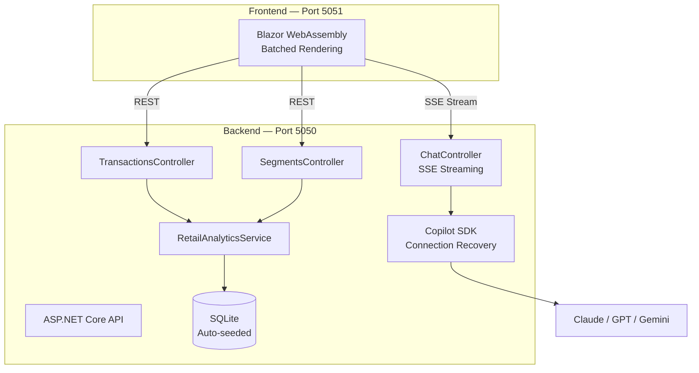

<a name="start-building"></a>
<!--
  Drop a banner image at img/banner.png and uncomment this block to enable it.
  <p align="center">
    
  </p>
-->

# AI Genius — Season 5, Episode 2

[](https://github.com/vicperdana/aigenius-copilotsdk-s5ep2/actions/workflows/ci.yml)
[](https://github.com/vicperdana/aigenius-copilotsdk-s5ep2/actions/workflows/codeql.yml)
[](https://blog.vicperdana.com/aigenius-copilotsdk-s5ep2/)
[](LICENSE)
[](https://dotnet.microsoft.com/)
[](https://www.python.org/)
[](https://github.com/github/copilot-sdk)

## 🔥 Agent HQ: Building a Retail Analytics Assistant with the GitHub Copilot SDK

### Session Description

Agents are impressive in a chat window, but the real value shows up when they
are embedded in an application your team already runs. This session builds a
retail transaction analytics assistant on the **GitHub Copilot SDK** — a .NET
10 API that streams model responses over SSE, a Blazor front end that renders
them live, and the governance scaffolding (custom agents, hooks, audit trails,
code scanning) that makes it safe to ship.

### Session Slides

See [`docs/`](docs/) — the "Three Mondays" narrative is captured in
`Slide1.png` – `Slide3.png`.

### 🧠 Learning Outcomes

By the end of this session, you will be able to:

- Embed the GitHub Copilot SDK runtime into an ASP.NET Core application
- Stream model responses to a browser token-by-token over Server-Sent Events
- Discover available models at runtime instead of hardcoding a stale list
- Apply enterprise governance — custom agents, hooks, audit logging, and
  code scanning — to AI-assisted development

### 💬 Keep Learning with Copilot

Try these prompts with GitHub Copilot to explore the topics from this session.
Open Copilot Chat in VS Code (`Ctrl+Alt+I` on Windows/Linux, `Cmd+Shift+I` on
Mac), paste a prompt, and see what you learn. Try connecting the
[Microsoft Learn MCP Server](#-microsoft-learn-mcp-server) for the latest
official documentation.

Use these as a starting point — or write your own!

- *What can I build with the GitHub Copilot SDK?*
- *How do I stream Copilot SDK responses over Server-Sent Events in ASP.NET Core?*
- *How do I list the models available to the signed-in Copilot account?*
- *How do I set up authentication for the Copilot SDK?*
- *What are Copilot hooks and how do I use them to enforce a security gate?*

### 📚 Resources and Next Steps

| Resource | Description |
|:---------|:------------|
| [GitHub Copilot SDK Repo](https://github.com/github/copilot-sdk) | The SDK across all supported languages |
| [Copilot SDK Getting Started](https://github.com/github/copilot-sdk/blob/main/docs/getting-started.md) | Build your first Copilot-powered app |
| [Awesome Copilot](https://github.com/github/awesome-copilot) | Custom agents, instructions, skills, hooks, workflows, and plugins |
| [GitHub Copilot Docs](https://docs.github.com/copilot) | Official product documentation |

### 🌟 Microsoft Learn MCP Server

The Microsoft Learn MCP Server gives your AI agent direct access to
Microsoft's official documentation — grounded, up-to-date answers about the
products and services covered in this session.

**VS Code** — this repo already ships [`.vscode/mcp.json`](.vscode/mcp.json),
so the server is configured when you open the folder.

**GitHub Copilot CLI** — run this to install the Learn MCP Server as a plugin:

```
/plugin install microsoftdocs/mcp
```

For more info, other clients, and to post questions, visit the
[Learn MCP Server repo](https://aka.ms/learnmcp).

---

## ✨ What This Demo Shows

| Capability | What You'll See |
|------------|-----------------|
| **Multi-Model AI Chat** | Model list fetched live from the Copilot CLI — always current |
| **Retail Analytics Domain** | Transaction data, customer segments, segment prediction |
| **Real-Time Streaming** | Token-by-token SSE responses with batched rendering |
| **Enterprise Governance** | Audit trails, policy hooks, security gates, code scanning |

## 🛠️ Tech Stack

The same application is implemented twice — pick whichever language you prefer.
Both tracks teach identical SDK concepts and expose an identical HTTP contract.

| Component | .NET track | Python track |
|-----------|------------|--------------|
| Runtime | .NET 10 LTS | Python 3.11+ ([uv](https://docs.astral.sh/uv/)) |
| AI SDK | GitHub Copilot SDK v1.0.13 | `github-copilot-sdk` v1.0.13 |
| Backend | ASP.NET Core Web API | FastAPI |
| Frontend | Blazor WebAssembly | Static HTML + vanilla JS |
| Database | SQLite + EF Core | SQLite + SQLModel |
| Model data access | MCP (`ModelContextProtocol`) | MCP (`mcp`) |
| Tests | xUnit (26) | pytest (30) |
| Lint | Roslyn analysers | Ruff |
| Ports | 5050 API / 5051 UI | 5070 (API + UI) |

| Shared | Technology |
|--------|------------|
| CI/CD | GitHub Actions |
| Security | CodeQL, custom agents |

## 🚀 Quick Start

### Prerequisites

- [GitHub Copilot CLI](https://docs.github.com/copilot) — signed in with an
  account that has Copilot access
- **.NET track:** [.NET 10 SDK](https://dotnet.microsoft.com/download)
- **Python track:** [Python 3.11+](https://www.python.org/downloads/) and
  [uv](https://docs.astral.sh/uv/getting-started/installation/)

### Run it — .NET

```bash
dotnet restore src/AgentOrchestrator/AgentHQDemo.slnx
dotnet build   src/AgentOrchestrator/AgentHQDemo.slnx

# Terminal 1 — API (SQLite DB auto-created and seeded on first run)
dotnet run --project src/AgentOrchestrator/AgentHQDemo.Api --urls "http://localhost:5050"

# Terminal 2 — Blazor UI
dotnet run --project src/AgentOrchestrator/AgentHQDemo.Web --urls "http://localhost:5051"
```

Then open <http://localhost:5051>. The API runs on 5050.

### Run it — Python

```bash
cd src/AgentOrchestrator-python
uv sync

# One server for both the API and the UI
uv run uvicorn app.main:app --port 5070
```

Then open <http://localhost:5070>.

The ports differ deliberately, so both stacks can run at the same time.

### GitHub Codespaces

1. Click **Code** → **Create codespace on main**
2. Wait for setup (~2 minutes)
3. Run the commands for whichever track you are following

### Copilot CLI binary

The Copilot SDK downloads a matching CLI binary from `registry.npmjs.org`
during build. If that registry is unreachable (corporate proxy, offline
machine) the build fails with `MSB3923`.
[`Directory.Build.props`](Directory.Build.props) works around this by reusing
a globally installed Copilot CLI when one is present:

```bash
npm install -g @github/copilot
```

Override or disable the detection if needed:

```bash
dotnet build -p:CopilotCliBinaryPath=/path/to/copilot   # use a specific binary
dotnet build -p:CopilotUseLocalCli=false                # always download
```

## 📡 API Endpoints

| Endpoint | Method | Description |
|----------|--------|-------------|
| `/api/chat/stream` | POST | Streaming chat (SSE) |
| `/api/chat/models` | GET | Available AI models (live from the Copilot CLI) |
| `/api/chat/health` | GET | Health check |
| `/api/transactions` | GET/POST | List or add transactions |
| `/api/transactions/{id}` | GET/DELETE | Transaction by ID |
| `/api/segments` | GET | Customer segments |
| `/api/segments/{id}` | GET | Segment details |
| `/api/segments/predict/{customerId}` | GET | Predict customer segment |

### Example calls

```bash
# Stream a chat response
curl -N -X POST http://localhost:5050/api/chat/stream \
  -H "Content-Type: application/json" \
  -d '{"prompt": "Which segment has the lowest retention?", "model": "claude-haiku-4.5"}'

# List transactions (10 seed records)
curl http://localhost:5050/api/transactions

# Predict customer segment
curl http://localhost:5050/api/segments/predict/C003
# → {"customerId":"C003","predictedSegment":"High Value","confidence":0.89,...}
```

## 🎯 Available Models

The model picker is populated at runtime from `GET /api/chat/models`, which
asks the Copilot CLI which models the signed-in account can actually use. The
exact list varies by account and changes over time — examples include
`claude-haiku-4.5` (default), `auto`, `claude-sonnet-*`, `claude-opus-*`,
`gpt-5.*`, and `gemini-*`.

> If the API can't reach the Copilot CLI, both the API and the UI fall back to
> a small static catalog so the demo still renders.

## 🏗️ Architecture



## 📂 Project Structure

```
.
├── .devcontainer/              # Codespaces configuration
├── .github/
│   ├── agents/                 # Custom Copilot agents
│   ├── hooks/                  # Governance + audit hooks
│   ├── prompts/                # Reusable prompts
│   ├── skills/                 # Copilot skills
│   ├── workflows/              # CI, CodeQL, setup
│   ├── copilot-instructions.md # Coding standards for all agents
│   └── copilot-review-instructions.md
├── .vscode/mcp.json            # MS Learn MCP server
├── docs/                       # Labs, walkthroughs, and reference material
├── img/                        # Session branding
├── src/
│   ├── AgentOrchestrator/          # .NET implementation
│   │   ├── AgentHQDemo.Api/        # Web API — chat, transactions, segments
│   │   ├── AgentHQDemo.McpServer/  # Read-only MCP server over retail.db
│   │   ├── AgentHQDemo.Web/        # Blazor WebAssembly UI
│   │   ├── samples/SdkLabs/        # Runnable lab samples
│   │   ├── tests/                  # xUnit tests (26)
│   │   └── AgentHQDemo.slnx        # Solution
│   └── AgentOrchestrator-python/   # Python implementation
│       ├── app/                    # FastAPI — routers, services, models, UI
│       ├── mcp_server/             # Read-only MCP server over retail.db
│       ├── sdk_labs/               # Runnable lab samples
│       ├── tests/                  # pytest tests (30)
│       └── pyproject.toml          # uv project
├── AGENTS.md                   # Guidelines for AI agents
└── Directory.Build.props       # Copilot CLI resolution
```

## 🗄️ Seed Data

The SQLite database is auto-created on first startup with **10 transactions**
across 5 customers (C001–C005), 4 categories, and 4 stores, plus:

| Segment | Customers | Avg Spend | Retention |
|---------|-----------|-----------|-----------|
| High Value | 150 | $850 | 92% |
| Regular | 3,200 | $180 | 78% |
| At Risk | 890 | $95 | 45% |
| New | 420 | $120 | 65% |

## 🤖 Custom Agents

| Agent | Purpose | Specialty |
|-------|---------|-----------|
| `dotnet-reviewer` | .NET code review | Security, performance, best practices |
| `security-scanner` | Vulnerability detection | OWASP Top 10, injection risks |
| `pr-summary` | PR documentation | Context-aware descriptions |

## 📋 Demo Materials

Full documentation lives in [`docs/`](docs/), grouped by track:

| Track | Labs | Demos |
|:------|:-----|:------|
| **.NET** | [Seven Copilot SDK exercises](docs/labs/) (~2 hours) — start at [Lab 01](docs/labs/01-setup/) | [Walkthroughs](docs/demos/) of the code in `src/AgentOrchestrator/` |
| **Python** | [The same seven exercises](docs/labs-python/) — start at [Lab 01](docs/labs-python/01-setup/) | [Walkthroughs](docs/demos-python/) of the code in `src/AgentOrchestrator-python/` |

Work **one** track, not both — they teach the same material.

Everything that belongs to neither track lives in
[**Breakouts**](docs/breakouts/):

| Group | What it is |
|:------|:-----------|
| Reference | [Architecture](docs/breakouts/architecture.md), [custom agents](docs/breakouts/custom-agents.md), [hooks](docs/breakouts/hooks-and-governance.md), [skills](docs/breakouts/skills.md), [troubleshooting](docs/breakouts/troubleshooting.md) |
| Hands-on extras | Copilot CLI labs shared by both tracks — [custom agents](docs/labs/extra-custom-agents/), [governance hooks](docs/labs/extra-governance-hooks/) |

## 🔐 Security Notes

This demo **intentionally** includes flawed code patterns so they can be found
live during code review and static analysis demonstrations:

| Flaw | .NET | Python |
|:-----|:-----|:-------|
| N+1 query (performance review) | `GetTransactionsWithSegmentsAsync` | `get_transactions_with_segments` |
| Missing null check (static analysis) | `GetTransactionAsync` | `get_transaction` |
| No input validation (security review) | `AddTransactionAsync` | `add_transaction` |
| Hardcoded threshold (code smell) | `PredictSegmentAsync` | `predict_segment` |

Both implementations carry the same four flaws, so the same answer key applies
to either track.

By contrast, the chat's database access is *not* one of the flaws. Both tracks
expose `retail.db` to the model through a read-only MCP server
(`AgentHQDemo.McpServer` / `mcp_server/`) that opens SQLite with `Mode=ReadOnly`
and publishes five specific domain tools rather than a generic query tool. The
REST API keeps its direct ORM access — MCP is for the model, not for the
application talking to its own database.

**Do not use in production without addressing these.** See
[`SECURITY.md`](SECURITY.md).

> **CodeQL note:** analysis is skipped while this repository is private, since
> code scanning requires GitHub Advanced Security. It runs automatically if the
> repo becomes public, or set the repository variable `ENABLE_CODEQL=true`.

## 🤝 Contributing

See [`AGENTS.md`](AGENTS.md) for repository guidelines,
[`CODE_OF_CONDUCT.md`](CODE_OF_CONDUCT.md) for community standards, and
[`SUPPORT.md`](SUPPORT.md) for how to get help.

## 📄 License

- **Code** — [MIT License](LICENSE)
- **Documentation and content** — [CC BY 4.0](LICENSE-DOCS)

---

Built with ❤️ using the [GitHub Copilot SDK](https://github.com/github/copilot-sdk)
