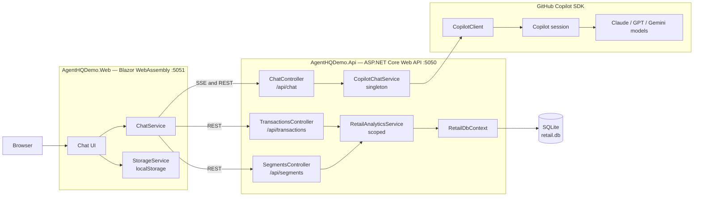
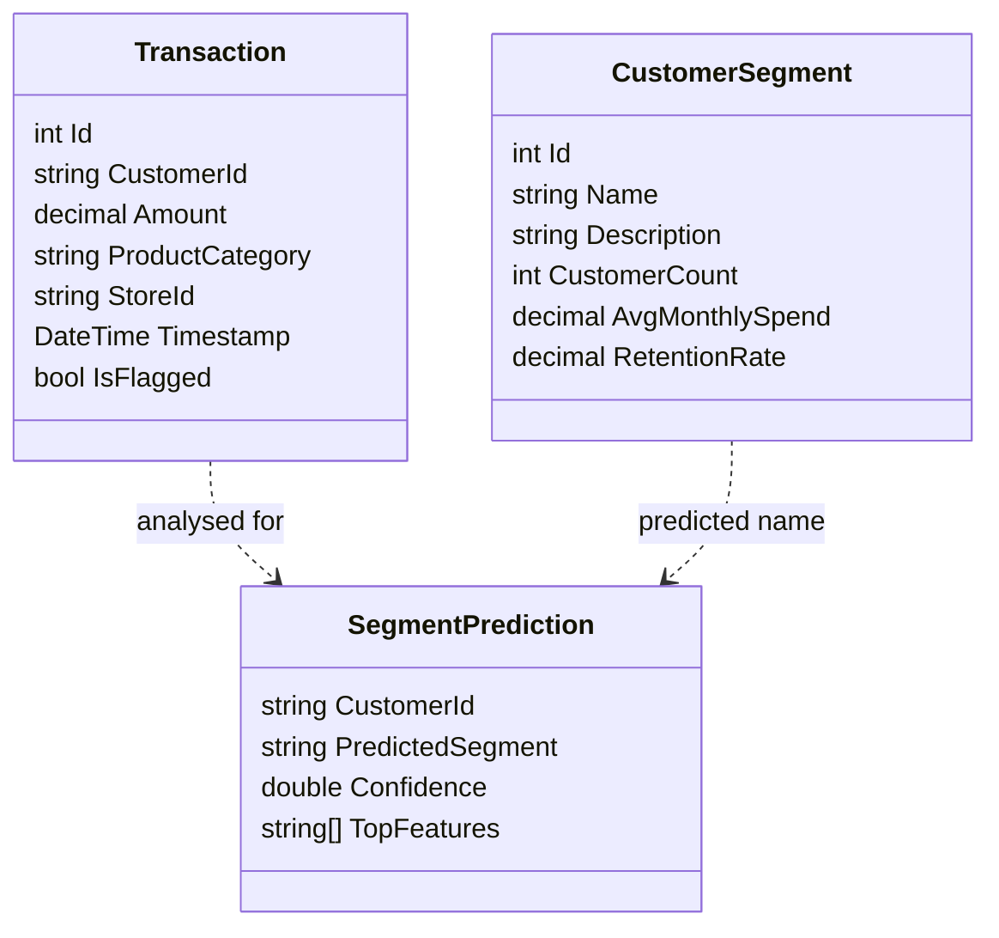

# Architecture

This page is a system reference for the AI Genius S5E2 Agent HQ demo. It
summarises the .NET 10 Blazor WebAssembly front end, ASP.NET Core Web API,
GitHub Copilot SDK integration, and zero-config SQLite analytics store.

## Component view

The demo runs as two local processes: the Blazor WebAssembly UI on port 5051
and the API on port 5050. `Program.cs` in the API registers
`CopilotChatService` as a singleton and `RetailAnalyticsService` as a scoped
service backed by `RetailDbContext`.



## SSE chat sequence

`AgentHQDemo.Web.Services.ChatService.StreamChatAsync` posts to
`/api/chat/stream` with `HttpCompletionOption.ResponseHeadersRead`. The API
sets `text/event-stream`, flushes each chunk, and terminates the stream with
`data: [DONE]`.

```mermaid
sequenceDiagram
    participant Browser as Browser
    participant UI as Blazor Home.razor
    participant WebChat as Web ChatService
    participant Controller as ChatController.StreamChat
    participant Service as CopilotChatService.ChatStreamAsync
    participant Client as CopilotClient session
    participant Channel as "Channel&lt;string&gt;"

    Browser->>UI: Submit prompt
    UI->>WebChat: StreamChatAsync(prompt, model)
    WebChat->>Controller: POST /api/chat/stream
    Controller->>Service: ChatStreamAsync(prompt, model)
    Service->>Client: CreateSessionAsync(SessionConfig)
    Service->>Client: session.On&lt;SessionEvent&gt;(...)
    Service->>Client: SendAsync(MessageOptions)
    Client-->>Service: AssistantMessageDeltaEvent
    Service-->>Channel: TryWrite(delta content)
    Channel-->>Controller: ReadAllAsync chunk
    Controller-->>WebChat: data: {"content":"..."}
    WebChat-->>UI: yield chunk
    UI-->>Browser: Batched render at about 20fps
    Client-->>Service: SessionIdleEvent
    Controller-->>WebChat: data: [DONE]
```

## Data model

`RetailDbContext` exposes `Transactions` and `Segments` sets. Segment
predictions are returned as a record from `RetailAnalyticsService` rather than
stored in SQLite.



## Repository layout

The implementation lives under `src/AgentOrchestrator/` with separate API, UI,
and test projects.

```text
src/AgentOrchestrator/
├── AgentHQDemo.Api/
│   ├── Controllers/
│   ├── Data/
│   ├── Models/
│   ├── Services/
│   └── Program.cs
├── AgentHQDemo.Web/
│   ├── Components/
│   ├── Layout/
│   ├── Pages/
│   ├── Services/
│   └── Program.cs
├── tests/
│   └── AgentHQDemo.Tests/
└── AgentHQDemo.slnx
```

## Key design decisions

- **Singleton Copilot client**:
  `AgentHQDemo.Api.Services.CopilotChatService` is registered as a singleton
  and holds one long-lived `CopilotClient`. `EnsureStartedAsync` recreates the
  client after connection loss.
- **Channel bridge for streaming**:
  Copilot SDK callbacks write assistant deltas to an unbounded
  `Channel<string>`. The API reads the channel as an `IAsyncEnumerable<string>`
  and turns each item into an SSE frame.
- **Runtime model discovery**:
  `CopilotChatService.ListModelsAsync` calls the Copilot SDK at runtime.
  `ChatController.GetModels` falls back to a static catalogue when the CLI
  cannot be reached or returns no models.
- **SQLite for zero-config analytics**:
  `Program.cs` uses `UseSqlite("Data Source=retail.db")`, calls
  `EnsureCreatedAsync`, and seeds sample retail data on startup.

## Related

- [Custom agents](./custom-agents.md)
- [Hooks and governance](./hooks-and-governance.md)
- [Troubleshooting](./troubleshooting.md)
- [API `Program.cs`](https://github.com/vicperdana/aigenius-copilotsdk-s5ep2/blob/main/src/AgentOrchestrator/AgentHQDemo.Api/Program.cs)
- [`CopilotChatService`](https://github.com/vicperdana/aigenius-copilotsdk-s5ep2/blob/main/src/AgentOrchestrator/AgentHQDemo.Api/Services/CopilotChatService.cs)
- [Web `ChatService`](https://github.com/vicperdana/aigenius-copilotsdk-s5ep2/blob/main/src/AgentOrchestrator/AgentHQDemo.Web/Services/ChatService.cs)
